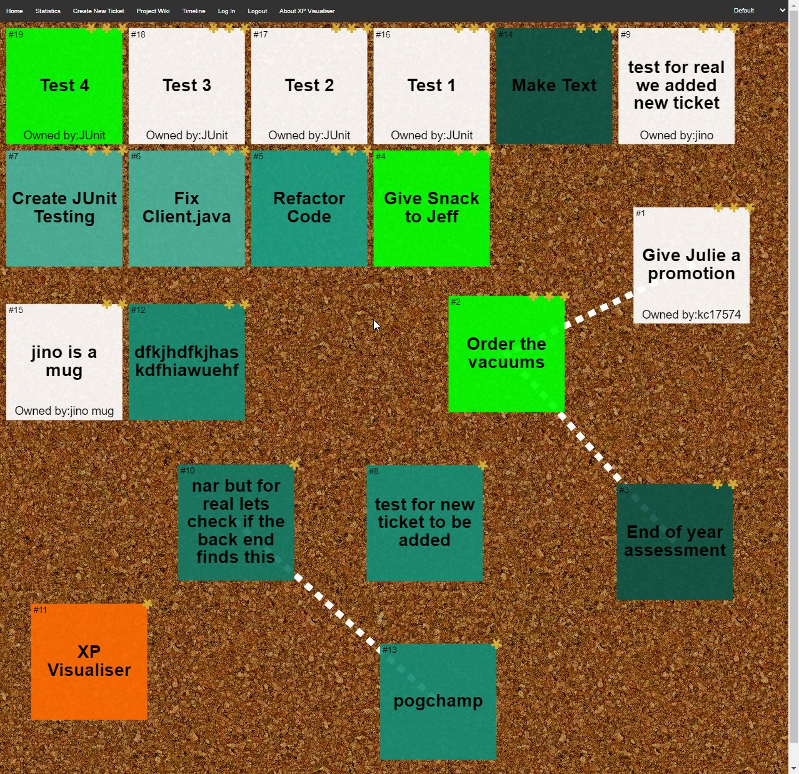
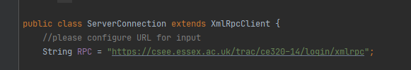
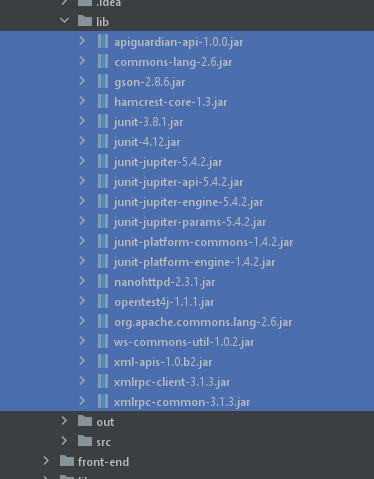
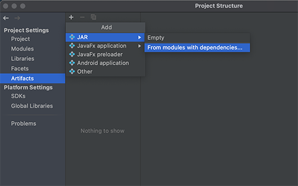
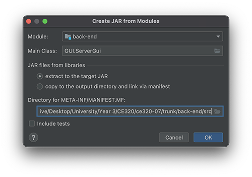
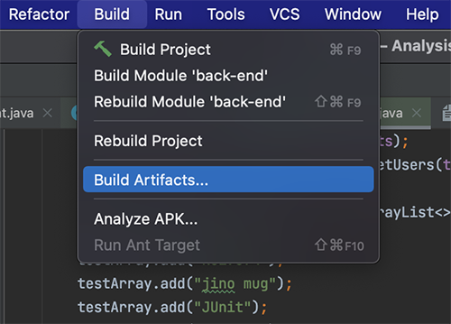
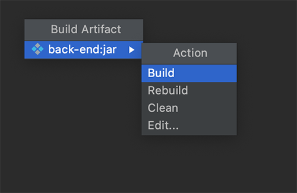

# XPlaniser: XP Release and Iteration Plan Visualiser

A standalone program which will use a Java Backend to pull data from Trac Server and will output the data through an HTML frontend.
The HTML frontend will provide the XP visualiser a Graphical Interface, where we can see the Trac tickets in a neat fashion, ordered and sorted by priority.

Developed by [ce320-07](https://csee.essex.ac.uk/trac/ce320-07/wiki)



## <u> Libraries </u>

#### Front-end

- Konva (javascript) https://konvajs.org/
- Grid (javascript) https://gridjs.io/
- Chart (javascript) https://www.chartjs.org/

#### Back-end

- J-Unit 5.4.2
- GSON
- XMLRPC
- Apache
- NanoHTTPd
- Hamcrest-core

#### Trac plugins

- Trac XML-RPC plugin https://trac-hacks.org/wiki/XmlRpcPlugin

## <u> Features </u>

| Feature                                       |
| --------------------------------------------- |
| Log in page                                   |
| Ticket board                                  |
| Open single ticket                            |
| Get ticket information from trac              |
| Display tickets graphically                   |
| Display ticket status graphically             |
| Graphing Tickets (Burn Rate)                  |
| Show relationship between tickets graphically |
| Open tickets trac page on internet            |
| Modify Tickets                                |
| Accessibility Features                        |
| Mobile responsive                             |

## <u> Iteration Plans </u>

| Iteration 1                                    | Iteration 2                          | Iteration 3                                              |
| ---------------------------------------------- | ------------------------------------ | -------------------------------------------------------- |
| Get ticket information from trac               | Automate ticket service to front end | Login manager                                            |
| Display tickets graphically                    | Login page                           | Two factor authentication                                |
| Open single ticket                             | Create ticket gui                    | Centralised server running in the cloud                  |
| Show relationships between tickets graphically | Mobile support                       | Dynamic frontend ticket positioning                      |
| Open tickets trac page on internet             | Responsive board sizing              | Mobile support                                           |
| -                                              | -                                    | Instant messaging                                        |
| -                                              | -                                    | Dynamically create lines between tickets in the frontend |
| -                                              | -                                    | Custom theme creator                                     |

## <u> Installation </u>

Before running XPlaniser, please install [Trac XML-RPC](https://trac-hacks.org/wiki/XmlRpcPlugin#SimpleInstallation) on your Trac Project Directory:

```
as found in Simple Installation on Trac XML-RPC page

pip install svn+https://trac-hacks.org/svn/xmlrpcplugin/trunk
trac-admin . config set components tracrpc.* enabled
trac-admin . permission add authenticated XML_RPC
```

### Simple Installation - Running buildscript

In the Releases folder, there is a bat file for Windows PC's, or a shell script for Mac based systems.
Simply Run runSystemWindows.bat or runSystemMac.sh relative to your machine.

This executes a pre-compiled JAR Executable called back-end.jar, this is the Backend Connection for the Trac Server.
In addition, it will execute a Browser to provide the Frontend Connection for the Trac Server.

The Trac Server configured for the release file is: https://csee.essex.ac.uk/trac/ce320-14/login/xmlrpc

### Advanced Installation - Compilation

These Instructions have been made using IntelliJ IDEA.

- Before compiling, please configure custom XMLRPC link in the back-end/src/server/ServerConnection.java file found in line 14:

  

- After configuring your own XMLRPC server, you will be able to compile. Make sure all the Libraries have been imported found in

  ```
  ./trunk/back-end/lib/*
  ```

  

- Open up Project Module Settings and Browse the Artifacts Menu, Create a New JAR From Modules with Dependencies

  

- Select the Main Class as GUI.ServerGUI and select Ok and Apply Settings

  

- Exit the Module Settings Menu and to start compiling, Select Build on the Toolbar in IntelliJ. Build using Build Artifacts

  

- After selecting back-end.jar in the build menu, select Build and it will compile a back-end.jar with your configured XMLRPC connection

  

- The compiled JAR will be built, simply run and the backend connection will be complete. It is found in this directory:

  ```
  ./trunk/back-end/out/artifacts/back-end.jar
  ```

- To execute frontend find login.html and run:
  ```
  ./trunk/front-end/stickyNoteBoard/login.html
  ```

## <u> Usage </u>

1. Login

- Enter login credential your in username & password
- Press login to access main page

2. Tickets

- Sorted by the priority with Top = high(3*), Middle= medium(2*) and Bottom = low(1\*).
- Each ticket displays what each one is about, it's owner and number.
- Tickets can be dragged and move around the page and also related tickets have lines linking them.
- Single tickets can be clicked on to reveal more information about it such as description, who its assigned to and open it on trac.

3. Create Tickets

- Located on the navigation bar at the top, when clicked a pop up box appears to be filled in.
- The information needed to create a ticket are; 'Summary'(title), 'Description', 'Type', 'Priority', 'keywords', 'Cc' & 'Assign to'.
- Select 'Create' and then click 'Submit Form' to finalise and create that ticket.

4. Project Wiki

- Located on the navigation bar and when clicked directs you to the project's wiki in trac.

5. Timeline

- Located on the navigation bar and when clicked directs you to the project's timeline in trac of activities with the tickets.

6. Theme

- Located on the navigation bar and when clicked a drop down box appears to select your desired theme for the program.
- The available themes are : Default, Dark mode, High contrast & Greyscale and can be set to your desired choice but will reset on refresh.

7. Statistics

- Located on the navigation bar and when clicked on, opens a new tab showing statistical analysis of the project.
- In the tab it'll show a burn chart of the current of the current project and each users statistic on how they're doing.

8. About XP Visualiser

- Located on the navigation bar and when clicked a pop up box appears displaying information about the program(XP visualiser).

9. Logout

- Located on the navigation bar and when clicked signs you out the page.
- In order to access the page again the login next to it, is to be clicked to then logged in again.
